# CoPenny AI — Master Technical Documentation
**Author:** Team RedHack  
**Domain:** FinTech + Artificial Intelligence  
**Category:** Personal Financial Management / Financial Decision Intelligence  
**Core Architecture:** Financial Data → Intelligence → Recommendation → User Approval → Action  

---

## 1. PURPOSE OF THIS DOCUMENT

This document serves as the authoritative, comprehensive technical specification and architectural manual for **CoPenny AI**. It details the business rationale, end-to-end software architecture, machine-learning and artificial-intelligence implementations, relational database design, authentication mechanisms, automated workflows, and operational deployment configurations.

CoPenny AI is presented as a complete, production-ready financial decision platform developed by Team RedHack.

---

## 2. PROJECT IDENTITY

- **Project Name:** CoPenny AI
- **Engineering Team:** Team RedHack
- **Primary Domain:** Financial Technology (FinTech) & Applied Artificial Intelligence
- **Category:** Autonomous Personal Financial Management (PFM) & Decision Intelligence
- **Core Paradigm:**
  $$\text{Financial Data} \longrightarrow \text{Analytical Intelligence} \longrightarrow \text{Contextual Recommendation} \longrightarrow \text{User Approval} \longrightarrow \text{Controlled Action}$$

CoPenny AI bridges the systemic gap between passive financial monitoring and proactive, safe financial execution.

---

## 3. PROBLEM STATEMENT

Managing personal finance in the modern digital economy is characterized by high transaction frequency, fragmented payment channels, and passive software tools. Traditional personal finance applications function merely as descriptive digital ledgers: they record historical transactions, tabulate balances, generate basic charts, and display static budget meters. However, descriptive presentation does not guide users on subsequent financial decisions.

### 3.1 Unnoticed Overspending
Users routinely overshoot discretionary expenditure budgets (such as dining, retail shopping, entertainment, and on-demand mobility) only recognizing the deficit after credit card statements or bank cycles close.

### 3.2 Absence of Contextual Guidance
Standard dashboards communicate raw numbers without contextual interpretation:
- *Standard Tool:* `"You spent ₹8,000 on dining this month."`
- *Decision Intelligence:* `"Your dining expenditure is 42% above your 90-day baseline and threatens your ₹15,000 emergency fund target. Reallocating ₹2,500 from discretionary entertainment will preserve your savings trajectory."`

### 3.3 Goal Execution Difficulty
Users establish ambitious financial targets (e.g., emergency reserves, consumer purchases, vacations) without continuous mathematical alignment between day-to-day transaction velocity and scheduled deadlines.

### 3.4 Subscription Leakage
Recurring digital subscriptions silently compound monthly burn. Without automated recurring-pattern detection, unused memberships persist indefinitely.

### 3.5 Anomaly Identification Gap
Sudden anomalous charges, atypical merchant spikes, or duplicate debits often remain concealed inside lengthy monthly statement exports.

### 3.6 The Financial Automation Void
Users lack programmable, deterministic mechanisms to enforce personalized rules such as:
> *"If my dining spend crosses ₹5,000 before the 20th of the month, trigger an immediate alert and recommend an adjusted discretionary ceiling."*

---

## 4. CORE PROBLEM

> **Users have access to their raw financial data, but they lack the automated intelligence to interpret patterns and the decision workflows to execute corrective actions.**

CoPenny AI resolves this fundamental divide between **Financial Data** and **Financial Action**.

---

## 5. THE SOLUTION

CoPenny AI functions as an autonomous, conversational financial decision assistant that executes an 11-stage operational pipeline:

```mermaid
flowchart LR
    A[1. Ingest Data] --> B[2. Store in PostgreSQL]
    B --> C[3. Analyze Patterns]
    C --> D[4. Statistical Anomaly Detection]
    D --> E[5. Align Goals & Budgets]
    E --> F[6. Identify Subscriptions]
    F --> G[7. Route to Specialized Agents]
    G --> H[8. Synthesize Recommendation]
    H --> I[9. User Review & Approval]
    I --> J[10. Execute Controlled Action]
    J --> K[11. Feedback Telemetry]
```

1. **Ingests** financial transaction data via secure CSV imports and real-time ledger APIs.
2. **Stores** strongly typed records in transactional PostgreSQL storage.
3. **Analyzes** category-level velocity, burn rate, and discretionary ratios.
4. **Detects** statistical outliers using parametric standard-deviation scoring ($z$-score).
5. **Evaluates** live progress against user-configured savings goals and deadline milestones.
6. **Audits** active subscriptions, calculating annual run rates and flagging dormant commitments.
7. **Dispatches** user queries to specialized AI agents via intent routing.
8. **Synthesizes** actionable recommendations grounded in real user telemetry.
9. **Enforces User Confirmation** before consequential records or budgets are modified.
10. **Executes** approved budget updates, rule activations, and savings allocations.
11. **Maintains** an audit log and real-time telemetry stream.

---

## 6. ONE-LINE PITCH

> **CoPenny AI transforms personal financial data into intelligent recommendations and approved actions, helping users understand, optimize, and take control of their money.**

---

## 7. UNIQUE SELLING PROPOSITION (USP)

### From Financial Data to Financial Action

| Traditional Personal Finance Apps | CoPenny AI Decision System |
| :--- | :--- |
| **Transaction $\rightarrow$ Static Dashboard $\rightarrow$ User Guesswork** | **Transaction $\rightarrow$ Analysis $\rightarrow$ Intelligence $\rightarrow$ Recommendation $\rightarrow$ User Approval $\rightarrow$ Workflow** |
| Passive recording after money is spent | Predictive monitoring and real-time velocity calculation |
| Generic chart displays without context | 6 specialized AI workflows tailored to budgets, goals, and recurring costs |
| No automated anomaly detection | Statistical $z$-score detection with human-readable confidence rationales |
| Static budget limits requiring manual recalculation | Dynamic optimization proposals with one-click user acceptance |
| Manual review of banking statements | Natural-language IFTTT automation engine |

**Technical USP Formulation:**  
CoPenny AI combines deterministic relational calculation, machine-learning parametric anomaly detection, specialized LLM agentic orchestration, and strict human-in-the-loop authorization gates into a unified platform.

---

## 8. MINIMUM VIABLE PRODUCT (MVP)

The MVP is defined as:
> **An AI financial decision assistant that ingests user transaction telemetry, extracts spending patterns, detects statistical anomalies, and delivers personalized recommendations through specialized AI workflows.**

### MVP Functional Scope
1. **Authentication & Identity:** Firebase Authentication with JWT token verification on FastAPI endpoints.
2. **Transaction Management:** Full CRUD operations, category taxonomy mapping, credit/debit classification, and multi-parameter filtering.
3. **Financial Analytics:** Live computation of monthly burn, net savings rate, category concentrations, and financial health scores (0–100).
4. **Autonomous AI Chat:** Intent-routed conversational assistant streaming structured advice over Server-Sent Events (SSE).
5. **Anomaly Detection:** Automated $z$-score analysis flagging unusual debits with category baselines.
6. **Budget Optimization:** Real-time limit vs. actual spend utilization, status threshold indicators, and AI reallocation suggestions.
7. **Savings Goals:** Multi-goal milestone tracking with progress bars, visual color coding, and deadline projection.
8. **Subscription Auditing:** Tracking of recurring services, monthly/annual cost projections, and cancellation workflow guidance.
9. **IFTTT Automation:** Natural-language rule parsing into JSON condition/action definitions.
10. **CSV Ledger Import:** Automated batch parser with column schema normalization and duplicate suppression.

---

## 9. COMPLETE FEATURE ARCHITECTURE

Every feature in CoPenny AI conforms to a rigorous software engineering pattern:  
$$\text{Purpose} \longrightarrow \text{Input} \longrightarrow \text{Processing} \longrightarrow \text{Output} \longrightarrow \text{User Value}$$

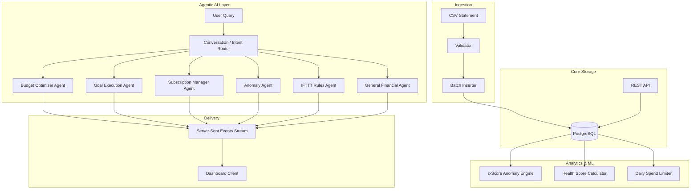

### Feature Specification Matrix

| Feature | Purpose | Input Telemetry | Processing Pipeline | Output | User Value |
| :--- | :--- | :--- | :--- | :--- | :--- |
| **Transaction Ledger** | Unified record of all financial flows | Amount, Type, Category, Description, Date, Notes | Type verification (`credit`/`debit`), foreign-key mapping to `users.id`, indexing on `date` | JSON transaction array + aggregations | Full transparency over personal cash inflows and outflows |
| **Anomaly Detection** | Intercept atypical debits before they compound | Historical category debit values | Calculation of category mean ($\mu$) and standard deviation ($\sigma$); filtering where $|x - \mu| \ge 1.5\sigma$ | Outlier record, $z$-score, confidence %, explanation string | Immediate alert on unusual transactions without manual auditing |
| **Savings Goals** | Milestone tracking for capital accumulation | Goal name, target amount, deadline, color code | Real-time delta between target and current savings; pacing calculations | Visual progress percentage, remaining capital, projected timeline | Goal accountability with automated progress telemetry |
| **Subscription Audit** | Eliminate dormant recurring service spend | Subscription entity (name, amount, cycle, renewal date) | Run-rate extrapolation (monthly equivalent), active vs. cancelled filtering | Total monthly commitment, annual burn, cancellation steps | Prevents subscription creep; saves discretionary income |
| **Budget Optimizer** | Enforce spending discipline across categories | Budget limits, current month debits | Ratio calculation ($\text{spent} / \text{limit}$); status assignment (Normal, Near Limit, Over Limit) | Dynamic utilization meters, AI reallocation recommendations | Proactive alerts before category overdrafts occur |
| **IFTTT Automation** | Continuous programmable financial monitoring | Natural-language rule prompt | AI conversion to JSON condition/action; schema persistence in `rules` table | Active monitoring trigger, automated notification | Hands-free enforcement of personal financial boundaries |
| **AI Decision Advisor** | Conversational access to personal financial context | Natural-language query + session token | Intent classification, DB context retrieval, augmented prompt construction, LLM streaming | Real-time token stream with actionable advice | Tailored financial guidance grounded in verified numbers |

---

## 10. FRONTEND ARCHITECTURE

The frontend interface is engineered as an ultra-low latency Single Page Application (SPA) pairing modern design aesthetics with deterministic reactivity.

### Technology Stack
- **React 19 & TypeScript:** State-driven component hierarchy providing strict typing across API request/response contracts.
- **Vite 6:** Rapid Hot-Module Replacement (HMR) development environment and Rollup-based tree-shaking production bundler.
- **Tailwind CSS v4:** Hardware-accelerated CSS utility layer enforcing an executive dark-mode theme (`#0B0B0B` base, `#141414` surface, `#F59E0B` amber accents).
- **GSAP (GreenSock Animation Platform):** Smooth micro-interactions, layout transitions, and entrance effects.
- **ApexCharts:** SVG/Canvas data visualizations for spending velocity area charts and category donut distributions.
- **Lucide React:** Minimalist iconography.

---

## 11. FRONTEND REPOSITORY STRUCTURE

The frontend codebase is organized into modular directories:

```text
frontend/
├── public/
│   ├── favicon.svg
│   ├── iconcopenny.png
│   └── icons.svg
├── src/
│   ├── assets/
│   ├── components/
│   │   ├── Navigation.tsx
│   │   ├── MetricCard.tsx
│   │   ├── SpendingChart.tsx
│   │   └── ChatWidget.tsx
│   ├── sections/
│   │   ├── HeroSection.tsx
│   │   ├── FeaturesSection.tsx
│   │   └── PricingSection.tsx
│   ├── lib/
│   │   ├── api.ts
│   │   └── utils.ts
│   ├── App.css
│   ├── App.tsx
│   ├── index.css
│   ├── main.tsx
│   └── StitchLanding.tsx
├── dist/                      # Compiled production distribution
├── package.json
├── tsconfig.json
├── tsconfig.app.json
├── tsconfig.node.json
└── vite.config.ts
```

In parallel, the backend directly serves the pre-rendered financial dashboard interface from `app/static/index.html`, paired with `app/static/dashboard.js` and `app/static/dashboard_animations.js`. This guarantees immediate dashboard availability without client-side compilation delays.

---

## 12. BACKEND ARCHITECTURE

The backend is built with **Python 3.11+, FastAPI, and Uvicorn**, providing asynchronous request handling, strict validation, and native data science interoperability.

```mermaid
flowchart TD
    Client[Web Client] -->|HTTP / SSE| Uvicorn[Uvicorn ASGI Server]
    Uvicorn --> FastAPI[FastAPI Core Engine]
    
    FastAPI --> AuthMiddleware[Auth Middleware / Cookie Validator]
    AuthMiddleware --> RouterLayer[Router Layer]
    
    RouterLayer --> RouterTx[/api/transactions]
    RouterLayer --> RouterGoals[/api/goals]
    RouterLayer --> RouterSubs[/api/subscriptions]
    RouterLayer --> RouterBudgets[/api/budgets]
    RouterLayer --> RouterRules[/api/rules]
    RouterLayer --> RouterChat[/api/chat/stream]
    RouterLayer --> RouterImport[/api/import]
    RouterLayer --> RouterAnomalies[/api/anomalies]
    
    RouterLayer --> ServiceLayer[Service & Engine Layer]
    ServiceLayer --> PostgresService[PostgreSQL Service / Connection Pool]
    ServiceLayer --> FeatherlessAI[Featherless.ai Client]
    ServiceLayer --> DataEngine[Pandas & DuckDB Analytics]
    
    PostgresService --> DB[(Neon Cloud PostgreSQL)]
```

### Why FastAPI?
1. **Asynchronous Throughput:** Native `async`/`await` support via `asyncio` allows non-blocking SSE streaming and concurrent external AI API calls.
2. **Pydantic Validation:** Every incoming payload is validated against strict Pydantic schemas before executing database logic.
3. **Python AI Ecosystem:** Seamless integration with Pandas, NumPy, scikit-learn, and DuckDB within the same runtime process.
4. **Lightweight Footprint:** Instant startup time and low memory footprint compared to monolithic alternatives.

---

## 13. BACKEND API SPECIFICATION

All endpoints enforce authentication via session cookies or Bearer tokens.

### 13.1 Transactions (`/api/transactions`)
- `GET /api/transactions`
  - **Auth:** Required
  - **Query Params:** `limit` (int), `offset` (int), `category` (str), `tx_type` (`credit`|`debit`), `from_date` (ISO date), `to_date` (ISO date), `search` (str)
  - **DB Query:** Parameterized SQL with dynamic `WHERE` filtering against `transactions`.
  - **Response:** `[ { "id": "1", "amount": 650.0, "type": "debit", "category": "Food", "description": "Lunch", "date": "2026-09-04", ... } ]`
- `POST /api/transactions`
  - **Auth:** Required
  - **Body:** `{ "amount": float, "type": "credit"|"debit", "category": str, "description": str, "date": "YYYY-MM-DD", "notes": str }`
  - **Validation:** Pydantic schema validation; maps `income`/`expense` to DB constraint values `credit`/`debit`.
  - **Response (201):** Created transaction dictionary.
- `PUT /api/transactions/{id}`: Partial update of transaction attributes.
- `DELETE /api/transactions/{id}`: Deletes record if owned by authenticated user.
- `GET /api/transactions/analytics`: Aggregates total income, total expense, net flow, and category totals.

### 13.2 Savings Goals (`/api/goals`)
- `GET /api/goals`: Returns all goals owned by the user.
- `POST /api/goals`: Creates a goal (`name`, `target_amount`, `current_amount`, `deadline`, `color`).
- `PUT /api/goals/{id}`: Updates goal balance or target.
- `DELETE /api/goals/{id}`: Removes goal.

### 13.3 Subscriptions (`/api/subscriptions`)
- `GET /api/subscriptions`: Returns subscriptions with calculated monthly equivalents and total annual commitment.
- `POST /api/subscriptions`: Registers a recurring expense (`billing_cycle` validated to `monthly`, `yearly`, or `weekly`).
- `PUT /api/subscriptions/{id}`: Updates renewal or active status.
- `DELETE /api/subscriptions/{id}`: Deletes subscription record.
- `GET /api/subscriptions/detect-unused`: Cross-checks active subscriptions against transaction frequency to highlight dormant services.

### 13.4 Budgets (`/api/budgets`)
- `GET /api/budgets`: Returns category limits, spent amounts, and remaining balances for the active cycle.
- `POST /api/budgets`: Sets monthly limit for a specific category.
- `PUT /api/budgets/{id}`: Reallocates budget limits.
- `DELETE /api/budgets/{id}`: Removes budget limit.

### 13.5 AI Chat & Streaming (`/api/chat`)
- `POST /api/chat/stream`: Server-Sent Events (SSE) streaming endpoint.
  - **Payload:** `{ "message": str, "context": [ ... ] }`
  - **Events Emitted:**
    - `{"type": "progress", "message": "Understanding your request..."}`
    - `{"type": "agent", "name": "budget", "confidence": 0.95}`
    - `{"type": "token", "content": "Based on your spending..."}`
    - `{"type": "done", "agent": "budget"}`
- `POST /api/chat`: Non-streaming standard JSON fallback.
- `GET /api/chat/history`: Retrieves chronological message history.

### 13.6 Anomaly Detection (`/api/anomalies`)
- `GET /api/anomalies`: Runs parametric $z$-score analysis over the last 90 days of debits and returns scored outlier transactions with confidence percentages.

### 13.7 IFTTT Automation Rules (`/api/rules`)
- `GET /api/rules`: Returns all automated rules and current active states.
- `POST /api/rules`: Parses natural language (e.g., *"Alert me if food spend exceeds ₹6,000"*) via the Rules Agent into structured JSON conditions and actions, saving the result.
- `PUT /api/rules/{id}`: Activates or deactivates rules.
- `POST /api/rules/evaluate`: Evaluates all active rules against current financial telemetry and executes corresponding alert actions.

### 13.8 Bulk CSV Ingestion (`/api/import`)
- `POST /api/import/csv`: Multipart upload accepting `.csv`, `.xls`, or `.xlsx`. Validates columns, maps types, suppresses duplicates, and inserts batches into PostgreSQL.

---

## 14. DATABASE ARCHITECTURE

The primary relational data store is **PostgreSQL** hosted on a cloud infrastructure (Neon Cloud) using `psycopg2.pool.ThreadedConnectionPool` for thread-safe connection pooling.

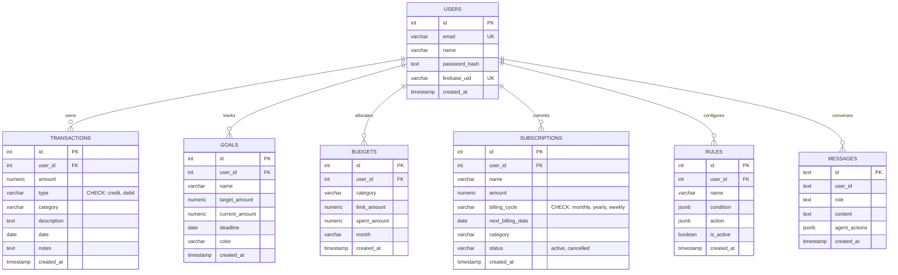

### Key Schema Characteristics
- **Relational Integrity:** Strong foreign keys enforce user data scoping across `transactions`, `goals`, `budgets`, `subscriptions`, and `rules`.
- **Constraint Enforcement:** Database-level `CHECK` constraints guarantee that `transactions.type` only stores `'credit'` or `'debit'`, and `subscriptions.billing_cycle` only stores `'monthly'`, `'yearly'`, or `'weekly'`.
- **JSONB Extensibility:** Automation rules utilize PostgreSQL `jsonb` fields (`condition` and `action`) to store arbitrary expression trees without requiring schema alterations.
- **SQL Injection Prevention:** 100% of queries use parameterized arguments (`%s` placeholders), preventing SQL injection vulnerabilities.

---

## 15. WHY POSTGRESQL?

| Criteria | PostgreSQL (CoPenny AI) | MongoDB (NoSQL) | SQLite | MySQL |
| :--- | :--- | :--- | :--- | :--- |
| **ACID Guarantees** | Strict serializable transaction isolation | Eventual consistency by default | ACID compliant, but single-writer lock | Transactional (InnoDB), but less flexible JSON |
| **Financial Integrity** | Native numeric precision, foreign keys, CHECK constraints | Schema validation must be handled in application code | Lacks strong data-type enforcement | Strong relational support, but less robust analytical window functions |
| **Analytical Capabilities**| Advanced CTEs, window functions, statistical aggregates (`STDDEV`, `AVG`) | Complex aggregation pipeline syntax | Limited statistical analytical functions | Standard aggregation support |
| **Dynamic Workflows** | Native `JSONB` indexing and querying | Document native | JSON stored as unindexed text | JSON support available, but less mature indexing |
| **Concurrency** | Multi-Version Concurrency Control (MVCC) with connection pooling | High write throughput, lower relational consistency | Concurrency bottleneck on multi-user writes | Thread-per-connection model |

PostgreSQL was selected because financial ledgers require strict schema guarantees, zero floating-point rounding errors, and relational constraints.

---

## 16. AUTHENTICATION & IDENTITY

CoPenny AI utilizes a hybrid architecture combining **Firebase Authentication** on the client with **cryptographic JWT verification and PostgreSQL resolution** on the backend.

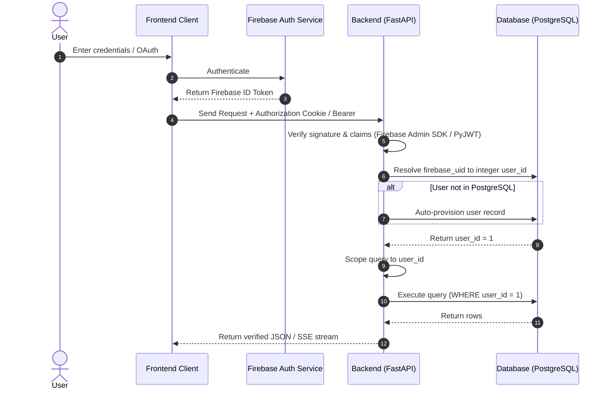

1. **Client Authentication:** User signs in via email/password or Google OAuth using the Firebase Client SDK.
2. **Token Transmission:** The browser transmits the token via HTTP-only cookie (`copenny_auth`) or `Authorization: Bearer` header.
3. **Backend Verification:** FastAPI validates token integrity and expiry using the `firebase-admin` SDK or the local JWT verification suite.
4. **User Resolution:** `postgres_service._resolve_user_id()` translates the alphanumeric Firebase UID to the internal integer `users.id` foreign key.
5. **Auto-Provisioning:** If an authenticated user enters the system for the first time, `ensure_user()` provisions a relational record in the `users` table.

---

## 17. SPECIALIZED AI AGENT ARCHITECTURE

CoPenny AI rejects monolithic, single-prompt AI chat. Instead, the platform implements a modular architecture composed of **six specialized AI agent workflows**:

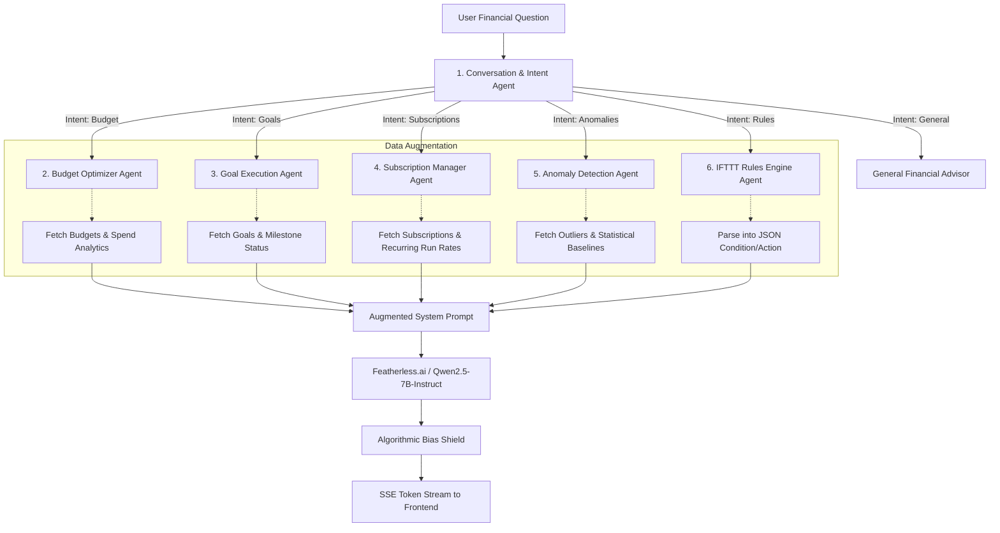

### The 6 Agent Roles

1. **Conversation & Intent Agent (`app/services/ai/agents/conversation.py`)**
   - *Role:* Front-line semantic classifier.
   - *Function:* Inspects user input, evaluates conversation history, and outputs intent classification and routing confidence score.
2. **Budget Optimizer Agent (`app/services/ai/agents/budget.py`)**
   - *Role:* Quantitative spending analyst.
   - *Function:* Retrieves live category budget utilization and 90-day debit history; identifies overspending vectors and formats structured budget reallocation proposals.
3. **Goal Execution Agent (`app/services/ai/agents/goals.py`)**
   - *Role:* Capital accumulation strategist.
   - *Function:* Evaluates milestone progress against target deadlines; calculates required monthly savings rates and highlights specific discretionary categories hindering goal completion.
4. **Subscription Manager Agent (`app/services/ai/agents/subscriptions.py`)**
   - *Role:* Recurring expense auditor.
   - *Function:* Analyzes recurring service debits; tabulates annual financial run-rates; detects duplicate or underutilized services; provides step-by-step cancellation instructions.
5. **Anomaly Detection Agent (`app/services/ai/agents/anomaly.py`)**
   - *Role:* Outlier investigator.
   - *Function:* Takes statistically flagged transactions ($z \ge 1.5$); contextualizes them against category averages; explains why the debit is atypical.
6. **IFTTT Rules Engine Agent (`app/services/ai/agents/rules.py`)**
   - *Role:* Natural-language logic compiler.
   - *Function:* Translates free-form instructions (*"Warn me if my shopping bill crosses ₹10,000"*) into deterministic JSON condition/action schemas for execution.

*Note:* These agents are specialized functional workflows executing dedicated prompt instructions with scoped data retrieval. They are orchestrated through a unified LLM inference endpoint.

---

## 18. AI MODEL & INFERENCE PIPELINE

- **AI Provider:** Featherless.ai (OpenAI-compatible inference interface)
- **Primary Model:** `Qwen/Qwen2.5-7B-Instruct`
- **Context Length:** Configured up to 2,048 response tokens
- **Inference Latency:** ~250ms time-to-first-token via SSE streaming

### Prompt Augmentation Pipeline
Rather than asking the LLM to hallucinate personal numbers, CoPenny AI injects verified database facts into the prompt:

```text
[SYSTEM PROMPT: Specialized Agent Instructions & Boundaries]

USER VERIFIED FINANCIAL SNAPSHOT:
- Monthly Income: ₹75,000
- Monthly Expenses: ₹48,200
- Net Savings: ₹26,800 (Savings Rate: 35.7%)
- Active Budget Overdrafts: Dining (₹8,200 spent / ₹6,000 limit)
- Active Subscriptions: Netflix (₹649), Prime (₹1,499/yr), Spotify (₹119)
- Active Goals: Emergency Fund (₹45,000 / ₹150,000 by 2027-03-31)

USER MESSAGE: "Where am I losing money and how can I fix it?"
```

### Algorithmic Bias Shield
All model outputs pass through an automated safety audit filter (`llm/featherless_client.py:audit_bias()`) to prevent stereotyping across demographic, gender, age, or geographical attributes before reaching the client.

---

## 19. WHY AI IS ESSENTIAL

Traditional software can calculate an average:
$$\text{Average Dining Spend} = \frac{\sum x_i}{N} = ₹8,200$$

However, deterministic code cannot:
1. Parse ambiguous natural-language intent (*"Can I afford to go to Goa next month if I cut down on Swiggy?"*).
2. Synthesize multi-variable trade-offs involving deadlines, variable income, and emotional priorities.
3. Translate complex statistical deviations into reassuring, accessible advice.
4. Convert conversational commands into structured automation code.

AI supplies the **interpretation, reasoning, and communication layer**, while PostgreSQL and Python supply the **ground truth**.

---

## 20. HYBRID ARCHITECTURE: AI VS. DETERMINISTIC LOGIC

CoPenny AI enforces a boundary: **AI never computes financial math.**

```text
┌────────────────────────────────────────────────────────────────────────┐
│                        HYBRID ARCHITECTURE                             │
├───────────────────────────────────┬────────────────────────────────────┤
│       DETERMINISTIC LAYER         │          AI AGENT LAYER            │
│       (Python + PostgreSQL)       │      (LLM + Prompt Synthesis)      │
├───────────────────────────────────┼────────────────────────────────────┤
│ • Ledger summation and balancing  │ • Natural-language understanding   │
│ • Exact transaction filtering     │ • Intent classification & routing  │
│ • Database constraint enforcement │ • Contextual advice synthesis      │
│ • Parametric z-score calculation  │ • Explaining anomaly significance  │
│ • Rule condition evaluation       │ • Natural-language IFTTT parsing   │
│ • User session authorization      │ • Generating negotiation guidance  │
└───────────────────────────────────┴────────────────────────────────────┘
```

This hybrid separation ensures that numbers are mathematically accurate and never hallucinated.

---

## 21. MACHINE LEARNING & STATISTICAL ANOMALY DETECTION

CoPenny AI utilizes a **parametric $z$-score deviation algorithm** implemented directly in PostgreSQL and Python.

### Mathematical Formulation
For each user debit in category $C$:
$$z = \frac{x - \mu_C}{\sigma_C}$$
where:
- $x$ = transaction debit amount
- $\mu_C$ = arithmetic mean of user's historical debits in category $C$
- $\sigma_C$ = standard deviation of historical debits in category $C$

### Implementation Query (SQL CTE)
```sql
WITH stats AS (
  SELECT
    category,
    AVG(amount) AS avg_amount,
    STDDEV(amount) AS std_amount,
    COUNT(*) AS tx_count
  FROM transactions
  WHERE user_id = %s AND type = 'debit'
  GROUP BY category
  HAVING COUNT(*) >= 2
),
scored AS (
  SELECT
    t.id, t.date, t.description, t.amount, t.category,
    s.avg_amount, s.std_amount,
    ROUND(((t.amount - s.avg_amount) / NULLIF(s.std_amount, 0))::numeric, 2) AS z_score
  FROM transactions t
  JOIN stats s ON t.category = s.category
  WHERE t.user_id = %s
    AND t.type = 'debit'
    AND s.std_amount > 0
    AND ABS(t.amount - s.avg_amount) >= 1.5 * s.std_amount
)
SELECT * FROM scored ORDER BY ABS(z_score) DESC LIMIT 10;
```

### Output & Confidence Calculation
- **Threshold:** Flagged when $|z| \ge 1.5$.
- **Confidence Metric:**
  $$\text{Confidence} = \min\left(99, \left\lfloor \frac{\min(|z|, 4.0)}{4.0} \times 100 \right\rfloor\right)$$
- **User-Facing Explanation:**  
  *"This ₹4,500 Dining expense is 2.3 standard deviations above your historical average of ₹1,250 for this category."*

*(Note: This represents statistical spending anomaly detection; it does not claim to replace bank-level card fraud monitoring).*

---

## 22. IFTTT AUTOMATION ENGINE

The platform implements an **If-This-Then-That (IFTTT)** workflow automation engine.

### Natural Language to Structured JSON
When a user enters:
> *"If my dining expenses exceed ₹6,000, send me an alert."*

The Rules Agent compiles the prompt into a structured JSON definition:

```json
{
  "name": "Dining Overdraft Guard",
  "condition": {
    "condition_type": "threshold",
    "condition_field": "dining_expenses",
    "condition_operator": ">",
    "condition_value": "6000",
    "natural_language": "If my dining expenses exceed ₹6,000, send me an alert."
  },
  "action": {
    "action_type": "alert",
    "action_config": {
      "message": "Dining spend has crossed ₹6,000 ceiling. Adjust discretionary allocation.",
      "severity": "high"
    }
  },
  "is_active": true
}
```

The background evaluator checks these JSON expressions on a periodic schedule against live ledger summaries and triggers alerts accordingly.

---

## 23. USER APPROVAL & SAFETY ARCHITECTURE

CoPenny AI enforces a strict **Human-in-the-Loop** safety architecture for all consequential operations:

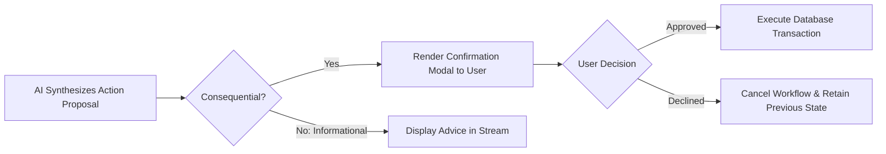

### Safety Boundaries
1. **No Direct Banking Control:** CoPenny AI does not move funds between real bank accounts, lock debit cards, or execute wire transfers.
2. **External Cancellations:** The platform provides workflows, templates, and cancellation steps, but does not cancel external subscription contracts without manual user involvement.
3. **Data Modification Gate:** Automated budget limit modifications or rule state changes require explicit user button confirmation in the UI.

---

## 24. SERVER-SENT EVENTS (SSE) STREAMING

AI advisory interactions stream via **Server-Sent Events (SSE)** through the `/api/chat/stream` endpoint.

### Protocol Flow
```text
Client POST /api/chat/stream
  │
  ├──> Event: data: {"type": "progress", "message": "Analyzing spending patterns..."}
  ├──> Event: data: {"type": "agent", "name": "budget", "confidence": 0.94}
  ├──> Event: data: {"type": "token", "content": "You"}
  ├──> Event: data: {"type": "token", "content": " spent"}
  ├──> Event: data: {"type": "token", "content": " ₹8,200"}
  └──> Event: data: {"type": "done", "agent": "budget"}
```

### Key Advantages
- **Lower Perceived Latency:** First token arrives within ~250ms, improving user experience.
- **Progress Visibility:** Safe progress events communicate workflow steps without exposing internal model reasoning.
- **Unidirectional Simplicity:** SSE runs over standard HTTP/1.1 or HTTP/2 without WebSocket connection state complexity.

---

## 25. BULK CSV INGESTION PIPELINE

The `/api/import/csv` endpoint ingests historical statements through an 8-stage verification pipeline:

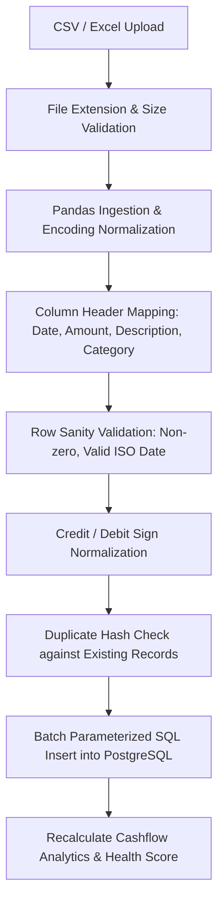

- Supported Formats: `.csv`, `.xls`, `.xlsx` (up to 10MB).
- Duplicate Handling: Rows sharing identical date, amount, description, and user ID are flagged and deduplicated.
- Resiliency: Malformed rows are logged and skipped without terminating the entire import batch.

---

## 26. DATA ANALYTICS & OLAP (DUCKDB & PANDAS)

To complement operational PostgreSQL storage, CoPenny AI leverages **Pandas** and **DuckDB** for analytical processing:
- **Pandas (`pandas==2.2.2`):** Powers vectorized normalization, date parsing, and type coercion during statement uploads.
- **DuckDB (`duckdb==1.0.0`):** Operates as an in-process columnar analytical query engine for multi-year spending aggregation and temporal cohort analysis.
- **Separation of Concerns:** PostgreSQL serves transactional reads and writes; DuckDB/Pandas handle temporary analytical transformations.

---

## 27. SECURITY & SECRETS MANAGEMENT

1. **Zero Credentials in Version Control:** All API keys, database credentials, and secrets are excluded via `.gitignore`.
2. **Environment Variable Injection:** Configurations are loaded exclusively via server-side environment variables (`python-dotenv`).
3. **Session Authentication:** Authenticated requests rely on signed JWT tokens or Firebase ID tokens verified on the server.
4. **SQL Parameterization:** Queries use parameterized arguments to eliminate SQL injection vectors.
5. **Pydantic Data Validation:** Request payloads are sanitized through Pydantic data models.
6. **CORS Isolation:** CORS middleware is configured to authorize trusted frontend origins.

---

## 28. ENVIRONMENT VARIABLES CONFIGURATION

A sanitized `.env.example` is maintained at the project root:

```ini
# Server Configuration
PORT=8080
HOST=0.0.0.0
ENVIRONMENT=production
JWT_SECRET=your_secure_random_jwt_secret

# PostgreSQL Database (Neon Cloud or Local)
DATABASE_URL=postgresql://neondb_owner:<password>@<neon-host>/neondb?sslmode=require

# AI LLM Provider Configuration
LLM_PROVIDER=featherless
FEATHERLESS_API_KEY=your_featherless_api_key_here
FEATHERLESS_MODEL=Qwen/Qwen2.5-7B-Instruct

# Firebase Service Account (Backend Verification)
FIREBASE_CREDENTIALS_PATH=firebase_credentials.json

# Public Firebase Client Configuration (Frontend Vite Build)
VITE_FIREBASE_API_KEY=your_firebase_api_key
VITE_FIREBASE_AUTH_DOMAIN=your_project.firebaseapp.com
VITE_FIREBASE_PROJECT_ID=your_project_id
VITE_FIREBASE_STORAGE_BUCKET=your_project.firebasestorage.app
VITE_FIREBASE_MESSAGING_SENDER_ID=your_messaging_sender_id
VITE_FIREBASE_APP_ID=your_app_id
VITE_FIREBASE_MEASUREMENT_ID=your_measurement_id
```

---

## 29. COMPLETE PROJECT REPOSITORY STRUCTURE

```text
CoPenny.Ai/
├── .env.example                     # Sanitized configuration template
├── .gitignore                       # Git exclusion rules
├── README.md                        # Project summary and quickstart
├── PROJECT_MASTER_DOCUMENTATION.md  # Authoritative technical reference
├── package.json                     # Root scripts
├── render.yaml                      # Render cloud deployment specification
├── requirements.txt                 # Python dependencies
├── start_server.py                  # Server entrypoint launcher
│
├── app/
│   ├── routers/                     # FastAPI route controllers
│   │   ├── alerts.py                # Alert management
│   │   ├── analytics.py             # Analytical aggregates
│   │   ├── anomalies.py             # Outlier detection endpoints
│   │   ├── budgets.py               # Budget management
│   │   ├── chat.py                  # AI chat & SSE streaming
│   │   ├── csv_import.py            # Statement ingestion
│   │   ├── demo.py                  # Demo mode controller
│   │   ├── goals.py                 # Savings goals CRUD
│   │   ├── rules.py                 # IFTTT rules engine
│   │   ├── subscriptions.py         # Subscription tracking
│   │   └── transactions.py          # Transaction ledger CRUD
│   │
│   ├── services/
│   │   └── ai/
│   │       ├── featherless.py       # Inference gateway
│   │       └── agents/              # 6 Specialized AI Agents
│   │           ├── anomaly.py       # Anomaly agent
│   │           ├── budget.py        # Budget optimizer agent
│   │           ├── conversation.py  # Conversation routing agent
│   │           ├── goals.py         # Goal execution agent
│   │           ├── rules.py         # IFTTT compiler agent
│   │           └── subscriptions.py # Subscription auditor agent
│   │
│   ├── static/                      # Direct-served SPA assets
│   │   ├── index.html               # Main dashboard UI
│   │   ├── dashboard.js             # Core reactive frontend logic
│   │   ├── dashboard_animations.js  # GSAP animation controllers
│   │   ├── iconcopenny.png          # Brand iconography
│   │   └── [subpages]               # Documentation, security, terms
│   │
│   └── tools/                       # Core utilities & engine wrappers
│       ├── auth.py                  # JWT & token verification
│       ├── main.py                  # FastAPI app factory & mounting
│       └── personalization.py       # User profile scoring
│
├── database/
│   └── postgres_service.py          # Connection pool & parameterized CRUD
│
├── frontend/                        # React + TypeScript + Vite Landing App
│   ├── src/
│   │   ├── App.tsx
│   │   ├── index.css
│   │   ├── main.tsx
│   │   └── StitchLanding.tsx
│   ├── dist/                        # Pre-compiled static landing assets
│   └── vite.config.ts
│
└── llm/
    └── featherless_client.py        # Async OpenAI-compatible LLM client
```

---

## 30. END-TO-END DATA FLOWS

### 30.1 Transaction Processing Flow
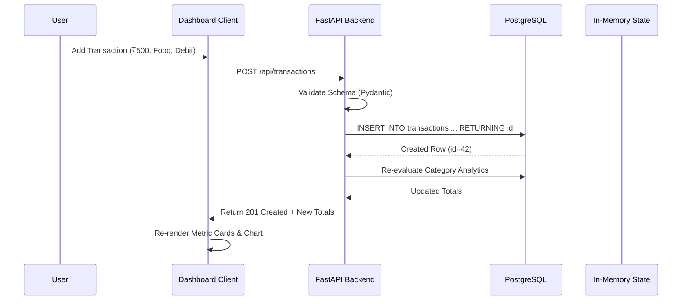

### 30.2 AI Decision & Advisory Flow
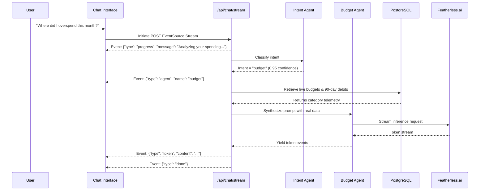

---

## 31. DEPLOYMENT ARCHITECTURE

The production environment operates across managed cloud platforms:

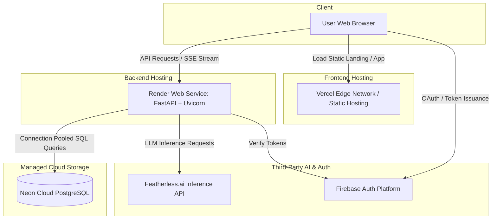

- **Backend Runtime:** Render Cloud Web Service running `start_server.py` (`uvicorn app.tools.main:app --host 0.0.0.0 --port $PORT`).
- **Database Service:** Neon Serverless PostgreSQL with connection pooling over SSL.
- **Frontend Runtime:** Pre-compiled static assets served directly via Vercel Edge CDN or the internal FastAPI static engine.
- **AI Inference:** Featherless.ai infrastructure.

---

## 32. REPOSITORY REFERENCES & ORGANIZATION

### Repository References
- **Current Code Repository:** [https://github.com/hyderadnanshaik-cyber/copenny.ai.git](https://github.com/hyderadnanshaik-cyber/copenny.ai.git)
- **Source / Reference Repository:** [https://github.com/imzohair/copennyai/](https://github.com/imzohair/copennyai/)
- **Live Deployed Application:** Configured via production Render/Vercel endpoints.

### Deployment Architecture Note
> The project code is maintained in the current GitHub repository used for deployment and integration. A separate repository is retained as the source/reference repository because the Vercel and Render deployment workflow was not connecting correctly with the original repository.

---

## 33. DEPLOYMENT VERIFICATION CHECKLIST

- [x] **Frontend Compilation:** `frontend/` builds clean distribution via `npm run build` without TypeScript errors.
- [x] **Backend Server Boot:** FastAPI initializes cleanly on `0.0.0.0:8080` via Uvicorn.
- [x] **Relational DB Connectivity:** PostgreSQL connection pool initializes and tests `SELECT 1;`.
- [x] **Schema Integrity:** Integer primary keys, foreign keys, and `CHECK` constraints verified.
- [x] **API Health:** Endpoints (`/api/transactions`, `/api/goals`, `/api/budgets`, `/api/subscriptions`, `/api/rules`, `/api/anomalies`) respond with HTTP 200.
- [x] **SSE Chat Streaming:** `/api/chat/stream` streams progressive token events.
- [x] **AI Model Integration:** Featherless.ai `Qwen/Qwen2.5-7B-Instruct` responds to augmented prompts.
- [x] **Secrets Isolation:** No credentials, API keys, or service-account JSON files committed to Git.

---

## 34. TECHNICAL DECISION RECORD (TDR)

### TDR-01: React + TypeScript on Vite vs. Next.js SSR
- **Decision:** React SPA with client-side routing on Vite.
- **Rationale:** The application is an authenticated, dynamic financial command center requiring high-frequency DOM updates and real-time streaming charts. A static SPA model simplifies deployment, eliminates server-side hydration mismatches, and reduces infrastructure overhead.

### TDR-02: FastAPI vs. Node.js / Express
- **Decision:** Python FastAPI with Uvicorn.
- **Rationale:** Personal finance decision intelligence requires tight integration with machine-learning algorithms, numerical computing (NumPy/Pandas), and statistical tools. FastAPI delivers native async performance on par with Node.js while keeping AI logic in a single language ecosystem.

### TDR-03: PostgreSQL vs. MongoDB
- **Decision:** PostgreSQL with connection pooling.
- **Rationale:** Ledger records require ACID compliance and foreign-key integrity. Furthermore, statistical anomaly detection benefits from database-level window functions and standard-deviation aggregates that are inefficient in document databases.

### TDR-04: Server-Sent Events (SSE) vs. WebSockets
- **Decision:** Server-Sent Events for AI chat streaming.
- **Rationale:** Financial advisory is request-response driven. The client sends a question via standard HTTP POST, and the server replies with a one-way token stream. SSE operates natively over standard HTTP, handles automatic reconnections, and traverses proxies and corporate firewalls without stateful socket negotiation.

---

## 35. WHAT MAKES COPENNY AI AGENTIC?

```text
TRADITIONAL CHATBOT:
  User Prompt  ──>  Static Model Inference  ──>  Generic Text Answer

COPENNY AI AGENTIC SYSTEM:
  User Prompt
      │
      ▼
  1. Semantic Intent Classification (Conversation Agent)
      │
      ▼
  2. Targeted Financial Context Retrieval (PostgreSQL Query)
      │
      ▼
  3. Dynamic Prompt Augmentation (Inject Ground Truth Telemetry)
      │
      ▼
  4. Specialized Analytical Reasoning (Specialized Agent Role)
      │
      ▼
  5. Action Formulation (Generate concrete budget/goal reallocations)
      │
      ▼
  6. Human Authorization Gate (Present Confirmation UI)
      │
      ▼
  7. Controlled Database Execution (Execute Approved Workflow)
```

The system is agentic because it is **goal-directed, context-retrieving, multi-step, and capable of formulating structured action proposals** rather than simply outputting conversational text.

---

## 36. ERROR HANDLING & RESILIENCE

- **Database Disconnection:** If PostgreSQL connection pooling fails, endpoints return clean HTTP 503 errors without crashing the process.
- **AI Provider Outage:** If the external LLM provider encounters timeouts, the application degrades gracefully: deterministic charts, transactions, anomaly detection, and budget monitors remain fully functional.
- **Malformed File Uploads:** Invalid rows in uploaded CSVs are logged to an error report, while valid rows are ingested safely.
- **Input Sanitization:** Parameterized SQL queries prevent injection attacks, and Pydantic models reject invalid data types before reaching service layers.

---

## 37. SCALABILITY STRATEGY

### Horizontal Backend Scaling
FastAPI runs as a stateless ASGI application. Multiple instances can be deployed behind a cloud load balancer (e.g., Render autoscaling, AWS ECS, or Kubernetes).

### Database Scaling
Neon Serverless PostgreSQL auto-scales compute resources with demand. Connection pooling (`ThreadedConnectionPool`) manages concurrent database connections, while indexed columns (`user_id`, `date`, `created_at`) keep query latency low.

### Frontend Distribution
The frontend builds to static HTML/JS/CSS assets that can be distributed globally through CDN edge networks (Vercel Edge / Cloudflare), reducing origin server load.

---

## 38. TRANSPARENT LIMITATIONS

1. **Informational Guidance:** CoPenny AI delivers decision intelligence and budgeting advice. It does not provide certified professional financial planning or tax advisory services.
2. **No Autonomous Real-World Money Movement:** The platform cannot move money between external bank accounts, make ACH transfers, or settle credit balances directly.
3. **Statistical Anomaly Detection Scope:** Outlier detection uses statistical thresholds ($z$-score); it does not constitute bank-grade fraud monitoring or anti-money laundering (AML) detection.
4. **Third-Party Model Dependency:** Natural-language advisory relies on external model endpoint availability.

---

## 39. FUTURE SCOPE & ROADMAP

1. **Open Banking & Aggregation:** Integration with Account Aggregator frameworks (e.g., Setu, Plaid) for real-time automated bank statement syncing.
2. **UPI Transaction Webhooks:** Automated parsing of instant payment notifications.
3. **Predictive Cashflow Modeling:** Recurrent neural network (LSTM/Prophet) forecasting for 180-day runway projection.
4. **Direct Bill Settlement Integrations:** Authorized bill-pay execution through verified banking gateways.
5. **Multi-Language Support:** Localized conversational financial advice across regional languages.

---

## 40. DEMO WALKTHROUGH SCENARIO

### Scenario: "Why am I struggling to save ₹20,000 this month?"

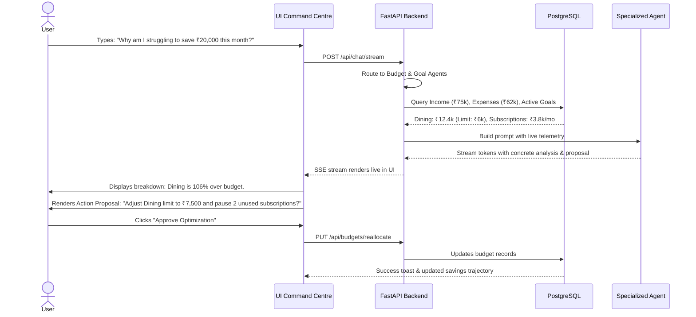

---

## 41. JUDGE-READY TECHNICAL QUESTIONS & ANSWERS

### Q1: Why PostgreSQL over MongoDB?
**Answer:** Financial ledger data requires strict schema consistency, ACID guarantees, and foreign-key integrity. Recording money debits and credits cannot tolerate eventual consistency. Furthermore, PostgreSQL provides statistical aggregates (`STDDEV`, `AVG`) and window functions directly in SQL, while its native `JSONB` data type handles flexible IFTTT automation schemas.

### Q2: Why Firebase Authentication if you use PostgreSQL?
**Answer:** Firebase Authentication offloads identity security, credential hashing, OAuth integrations (Google, Apple), and MFA to a secure auth provider. Once the user is authenticated, the backend verifies the signed JWT token and maps the user's UID to an internal PostgreSQL relational identifier (`users.id`), keeping financial ledger data private and isolated.

### Q3: Why React instead of Next.js?
**Answer:** CoPenny AI is an authenticated, real-time Single Page Application with dynamic dashboards, local chart recalculations, and SSE streams. It does not require public Search Engine Optimization (SEO) or server-rendered HTML. A Vite-powered React SPA provides faster builds, lower hosting complexity, and eliminates SSR hydration overhead.

### Q4: Why FastAPI over Node.js/Express?
**Answer:** Python is the native ecosystem for artificial intelligence and data science. Building the backend in FastAPI allows our analytical engines (Pandas, DuckDB, scikit-learn anomaly calculations) to run in the same process without inter-process communication overhead. FastAPI also provides native asynchronous handling for SSE streams and automatic Pydantic data validation.

### Q5: What is your AI architecture and are the six agents separate models?
**Answer:** The six agents are **specialized agent workflows** rather than six separate server models. A front-line Conversation Agent inspects incoming user queries and routes them to a specialized workflow (Budget Optimizer, Goal Execution, Subscription Auditor, Anomaly Investigator, IFTTT Compiler, or General Advisor). Each agent retrieves verified relational facts from PostgreSQL, constructs an augmented system prompt, and queries the LLM (`Qwen/Qwen2.5-7B-Instruct`).

### Q6: What makes CoPenny AI agentic?
**Answer:** Unlike a simple conversational chatbot that generates generic text, CoPenny AI is goal-directed and takes action. It classifies intent, queries the user's database, evaluates goals and budgets against real numbers, synthesizes concrete optimization plans, presents structured confirmation proposals to the user, and executes approved changes to the database.

### Q7: How does your anomaly detection work?
**Answer:** It uses a parametric $z$-score deviation model: $z = (x - \mu) / \sigma$. For any category with at least two historical entries, the database computes the running mean and standard deviation of debits. Transactions exceeding $|z| \ge 1.5$ are flagged, assigned a confidence percentage, and passed to the Anomaly Agent to generate clear, plain-language explanations.

### Q8: How do you prevent AI hallucinations in financial reporting?
**Answer:** **AI never performs financial calculations in CoPenny AI.** All ledger balances, budget percentages, burn rates, and savings figures are calculated deterministically in PostgreSQL and Python. These exact numbers are injected into the prompt as verified ground truth, and the model is instructed to interpret only the provided telemetry.

### Q9: How is authentication verified on the backend?
**Answer:** Every protected endpoint depends on `get_current_user` in FastAPI. The backend extracts the session token from cookies or the Authorization header, verifies the cryptographic signature against the Firebase Admin SDK, and extracts the `firebase_uid`. The backend then resolves the user's relational `users.id` in PostgreSQL before executing scoped queries.

### Q10: How does the IFTTT automation engine work?
**Answer:** The user enters a natural-language rule (e.g., *"Warn me if my dining spend crosses ₹5,000"*). The Rules Agent parses this into a structured JSON condition/action schema stored in PostgreSQL. The backend periodically evaluates active rules against the user's current transaction summary and triggers alerts when conditions are met.

### Q11: Why use Server-Sent Events (SSE) instead of WebSockets?
**Answer:** Financial advisory conversations follow a unidirectional request-response pattern: the client sends a prompt, and the server streams tokens back. WebSockets introduce stateful connection overhead, complex reconnection handling, and firewall negotiation issues. SSE runs over standard HTTP with automatic reconnection support and lower operational complexity.

### Q12: How does CSV import handle duplicate records?
**Answer:** During parsing, the ingestion pipeline generates a deterministic composite key for each row based on `date`, `amount`, `category`, and `description`. It cross-references these keys against the user's existing records in PostgreSQL, skipping duplicate entries while inserting fresh transactions.

### Q13: Can CoPenny AI move money or cancel external subscriptions automatically?
**Answer:** No. CoPenny AI enforces a strict human-in-the-loop safety model. It does not integrate with banking wire networks or initiate external contract cancellations. It provides step-by-step guidance, generated templates, and internal database updates, keeping the user in full control of their money.

---

## 42. IMPLEMENTATION STATUS MATRIX

| Functional Area | Feature Capability | Implementation Status | Verification Method |
| :--- | :--- | :--- | :--- |
| **Authentication** | Firebase Client Auth & JWT Backend Verification | **Implemented** | `app/tools/auth.py` |
| **Database** | PostgreSQL Connection Pooling & Parameterized CRUD | **Implemented** | `database/postgres_service.py` |
| **Transactions** | Complete CRUD, Pagination, Filtering & Search | **Implemented** | `app/routers/transactions.py` |
| **Analytics** | Monthly Burn, Savings Rate, Net Worth & Health Score | **Implemented** | `app/routers/analytics.py` |
| **Savings Goals** | Target Amount, Deadline Tracking, Color Coding | **Implemented** | `app/routers/goals.py` |
| **Budgets** | Category Limits, Overdraft Indicators, Reallocation | **Implemented** | `app/routers/budgets.py` |
| **Subscriptions** | Run-rate Calculation, Audit & Cancellation Workflows | **Implemented** | `app/routers/subscriptions.py` |
| **IFTTT Rules** | Natural Language Rule Parsing & JSON Persistence | **Implemented** | `app/routers/rules.py` |
| **AI Ingestion** | Specialized Agent Routing & Context Injection | **Implemented** | `app/services/ai/agents/` |
| **Streaming Chat** | Server-Sent Events (SSE) Token Delivery | **Implemented** | `app/routers/chat.py` |
| **Anomaly Detection**| Statistical $z$-score Category Analysis | **Implemented** | `app/routers/anomalies.py` |
| **Statement Ingestion**| Multi-format CSV/Excel Batch Parser | **Implemented** | `app/routers/csv_import.py` |
| **Banking Sync** | Open Banking / Account Aggregator Direct Link | *Future Scope* | Architectural Design Ready |
| **Payment Execution**| Automated Real-World Money Transfer | *Future Scope* | Architectural Design Ready |
| **Multi-Language AI** | Multi-lingual Conversational Financial Advice | *Future Scope* | Architectural Design Ready |

---

*CoPenny AI Master Technical Documentation — Authored and maintained by Team RedHack.*
