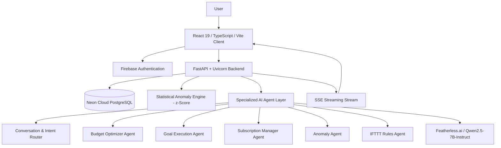

# CoPenny AI

> **CoPenny AI transforms personal financial data into intelligent recommendations and approved actions, helping users understand, optimize, and take control of their money.**

**Engineered by Team RedHack**  
*Domain: FinTech + Artificial Intelligence | Category: Financial Decision Intelligence*

---

## 📌 Problem

Traditional personal finance tools act as passive ledgers. They display historical charts, list transactions, and show remaining balances, but fail to guide users on what to do next. Users struggle with:
- **Unnoticed Overspending:** Finding out about category budget overruns only after month-end statements arrive.
- **Lack of Contextual Guidance:** Seeing numbers without actionable interpretation.
- **Savings Difficulties:** Misaligning day-to-day spending with long-term target milestones.
- **Subscription Creep:** Accumulating unnoticed recurring payments that compound monthly burn.
- **Hidden Outliers:** Missing atypical debits buried within transaction lists.
- **Manual Enforcement:** Lacking programmable automation to enforce personalized financial rules.

---

## 💡 Solution

CoPenny AI functions as an autonomous, conversational financial decision assistant. Rather than simply displaying past data, CoPenny AI analyzes live transaction velocity, audits recurring commitments, flags statistical spending anomalies ($z$-score), and provides personalized recommendations through specialized AI workflows—enforcing user approval before any changes take effect.

---

## 💎 Unique Selling Proposition (USP)

### From Financial Data to Financial Action

```text
Traditional App : Transaction  ──>  Static Dashboard  ──>  User Guesswork
CoPenny AI      : Transaction  ──>  Analysis  ──>  Intelligence  ──>  Recommendation  ──>  User Approval  ──>  Workflow
```

CoPenny AI combines deterministic calculation, machine-learning anomaly detection, specialized LLM agentic orchestration, and strict human-in-the-loop authorization gates into a unified platform.

---

## ✨ Features

- **Autonomous AI Advisor:** Context-aware conversational assistant streaming real-time tokens over Server-Sent Events (SSE).
- **Statistical Anomaly Detection:** Parametric $z$-score analysis ($|z| \ge 1.5$) detecting atypical debits with plain-language confidence explanations.
- **Budget Optimization:** Real-time utilization tracking with AI-suggested category reallocations.
- **Savings Goal Milestones:** Goal tracking with deadline pacing and visual progress metrics.
- **Subscription Sentinel:** Recurring payment cataloging, annual run-rate calculation, and cancellation guides.
- **Natural-Language IFTTT Automation:** Natural-language rule synthesis (*"If dining spend crosses ₹6,000, send an alert"*) compiled into deterministic JSON condition/action triggers.
- **Multi-Format Statement Ingestion:** Bulk CSV/Excel importer with column schema normalization and duplicate suppression.

---

## 🏗️ Architecture



---

## 🛠️ Technology Stack

| Layer | Technologies |
| :--- | :--- |
| **Frontend** | React 19, TypeScript, Vite 6, Tailwind CSS v4, GSAP, ApexCharts, Lucide Icons |
| **Backend** | Python 3.11+, FastAPI, Uvicorn, Pydantic, SlowAPI rate limiting |
| **Database** | Serverless PostgreSQL (Neon Cloud) with `ThreadedConnectionPool` |
| **AI / LLM** | Featherless.ai (`Qwen/Qwen2.5-7B-Instruct`) via OpenAI-compatible async client |
| **Analytics** | Pandas 2.2, DuckDB 1.0, NumPy, scikit-learn |
| **Authentication**| Firebase Admin SDK + JWT Session Token Verification |

---

## 🧠 AI & Agent Architecture

CoPenny AI uses **six specialized functional agent workflows** powered by `Qwen/Qwen2.5-7B-Instruct`:
1. **Conversation & Intent Agent:** Front-line semantic classifier routing requests.
2. **Budget Optimizer Agent:** Quantitative spending analyst evaluating budget caps.
3. **Goal Execution Agent:** Milestone strategist computing deadline pacing.
4. **Subscription Manager Agent:** Recurring auditor calculating annual run-rates.
5. **Anomaly Detection Agent:** Outlier investigator explaining $z$-score spikes.
6. **IFTTT Rules Engine Agent:** Natural-language rule compiler generating structured JSON.

*Deterministic Separation:* **AI never performs financial calculations.** All ledger balances, sums, and percentages are computed in PostgreSQL and Python, and injected into system prompts as ground truth.

---

## 🗄️ Database

PostgreSQL serves as the primary relational store with foreign-key integrity, ACID transaction guarantees, and `CHECK` constraints (`type` IN `'credit'`, `'debit'`; `billing_cycle` IN `'monthly'`, `'yearly'`, `'weekly'`). Flexible JSONB fields power IFTTT rule representations and action payloads.

---

## 🚀 Getting Started

### 1. Prerequisites
- Python 3.10+
- Node.js 18+ & npm
- PostgreSQL connection string (e.g. Neon Cloud)
- Featherless.ai API Key

### 2. Setup Environment Variables
Copy `.env.example` to `.env` and fill in your values:
```bash
cp .env.example .env
```
Key variables:
```env
PORT=8080
DATABASE_URL=postgresql://<user>:<password>@<neon-host>/neondb?sslmode=require
LLM_PROVIDER=featherless
FEATHERLESS_API_KEY=your_featherless_api_key
FEATHERLESS_MODEL=Qwen/Qwen2.5-7B-Instruct
JWT_SECRET=your_jwt_secret_key
```

### 3. Install Backend Dependencies
```bash
pip install -r requirements.txt
```

### 4. Build Frontend Assets
```bash
cd frontend
npm install
npm run build
cd ..
```

### 5. Start the Application
```bash
python start_server.py
```
Visit `http://localhost:8080/demo` for immediate dashboard access, or `http://localhost:8080/landing` for the landing experience.

---

## 🌐 Deployment

CoPenny AI is configured for cloud deployment:
- **Backend:** Hosted on Render as a Web Service running `start_server.py` (`render.yaml` included).
- **Database:** Neon Serverless PostgreSQL with SSL.
- **Frontend:** Deployed via Vercel Edge network or served directly by FastAPI.

---

## 📂 Repositories & References

- **Current Code Repository:** [https://github.com/hyderadnanshaik-cyber/copenny.ai.git](https://github.com/hyderadnanshaik-cyber/copenny.ai.git)
- **Source / Reference Repository:** [https://github.com/imzohair/copennyai/](https://github.com/imzohair/copennyai/)

*Deployment Architecture Note:* The project code is maintained in the current GitHub repository used for deployment and integration. A separate repository is retained as the source/reference repository because the Vercel and Render deployment workflow was not connecting correctly with the original repository.

---

## 📖 Complete Documentation

For the comprehensive technical specification, architecture diagrams, algorithm formulations, judge-ready Q&A, and data flows, refer to:  
👉 **[`PROJECT_MASTER_DOCUMENTATION.md`](./PROJECT_MASTER_DOCUMENTATION.md)**

---

*CoPenny AI — Built by Team RedHack.*